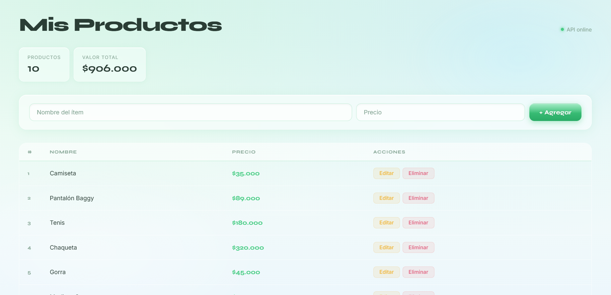

# Express CRUD API

A lightweight inventory manager built with Node.js and Express, powered by Firebase for real-time data persistence and automated workflows using n8n.

This started as a university exercise. The initial goal was to connect a backend to a real UI beyond Postman. It evolved into a fully deployed full-stack app with a public API, cloud database, automation workflows and live frontend.

---

## Live Demo

- Frontend: https://express-crud-api-bnradon.vercel.app/
- API: https://express-crud-api-bnradon.onrender.com/items
- Google Sheets Sync: https://docs.google.com/spreadsheets/d/1yjLuSYvkeEuaXs22j4UAbrlkyp_kob9LFgfGI1CUWXo/edit

---

## What it does

- Create, read, update and delete products from a clean interface  
- Frontend communicates with a deployed REST API  
- Real-time stats (total products, total value)  
- Error handling for network/server failures  
- Delete confirmation to avoid accidental data loss  
- Data persistence using Firebase (Firestore)  
- Logging middleware captures incoming requests  
- **Webhook integration with n8n for real-time automation**  
- **Automatic sync of data into Google Sheets**  

---

## Tech stack

| Layer | Technology |
|-------|-----------|
| Backend | Node.js, Express |
| Frontend | Vanilla JS, HTML, CSS |
| Database | Firebase (Firestore) |
| Automation | n8n (Webhooks + Workflows) |
| Backend Deployment | Render |
| Frontend Deployment | Vercel |
| Automation Hosting | Railway |
| Logging | Custom middleware logger |

---

## Project structure


├── src/
│   ├── controllers/  # Business logic for each endpoint
│   ├── routes/       # API routes
│   └── utils/        # Logger and Firebase config
├── front/            # Frontend (HTML, CSS, JS)
├── server.js         # Express app setup
├── index.js          # Entry point for deployment
└── package.json     

---

## API Endpoints

| Method | Endpoint | Description |
|--------|----------|-------------|
| GET | /items | Get all items |
| GET | /items/:id | Get item by id |
| POST | /items | Create item |
| PUT | /items/:id | Update item |
| DELETE | /items/:id | Delete item |

---

## How it works

- The frontend sends HTTP requests using `fetch()` to the deployed API  
- The Express backend handles routing, validation and business logic  
- Controllers interact with Firebase using the Admin SDK  
- Data is stored in a Firestore collection (`items`)  
- A webhook is triggered on item creation  
- n8n receives the webhook and processes the data  
- The workflow automatically stores the data into Google Sheets  
- Responses are returned as JSON and rendered dynamically in the UI  

---

## Automation Flow (n8n)

1. Item is created via API (POST /items)  
2. Backend sends data to an n8n webhook  
3. n8n workflow processes the request  
4. Data is mapped and inserted into Google Sheets  

---

## Preview



---

## Run locally

```bash
git clone https://github.com/bnradon/Express-CRUD-API
cd Express-CRUD-API
npm install

# Start backend
npm start

# Open frontend
front/index.html


## Enviroment variables 

For deployment, Firebase credentials are handled using environment variables instead of local JSON files:

FIREBASE_PROJECT_ID=YOUR_PROJECT_ID
FIREBASE_CLIENT_EMAIL=YOUR_EMAIL
FIREBASE_PRIVATE_KEY=YOUR_KEY
```

---

## What I improved from the initial version

- Deployed backend to production (Render)
- Deployed frontend (Vercel)
- Connected frontend to a live API
- Moved Firebase credentials to environment variables
- Handled CORS issues
- Structured project for real-world usage
- Implemented webhook-based automation with n8n
- Integrated external services (Google Sheets)


---

## What I'd improve next

- Add authentication (users & roles)
- Input validation (Joi / Zod)
- Pagination & filtering
- Better UI/UX
- Event-based architecture (queues / async processing)

---

*Built by [@bnradon] (https://github.com/bnradon) as part of my backend and full-stack learning journey :)
